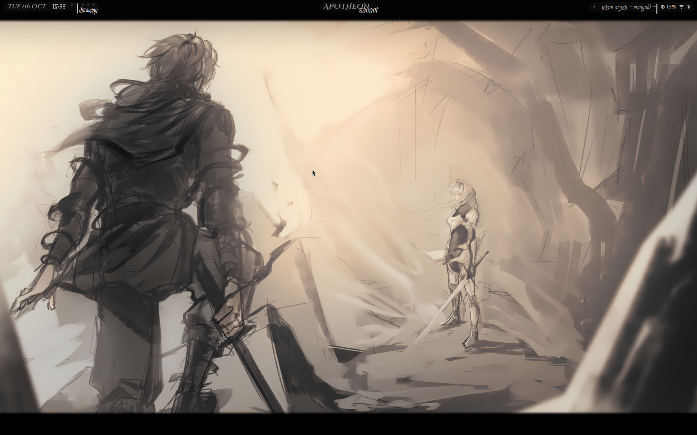
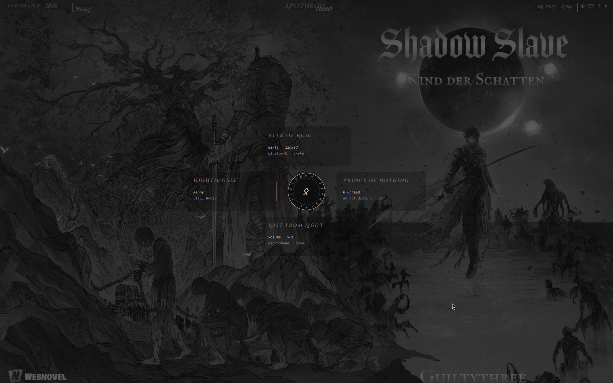
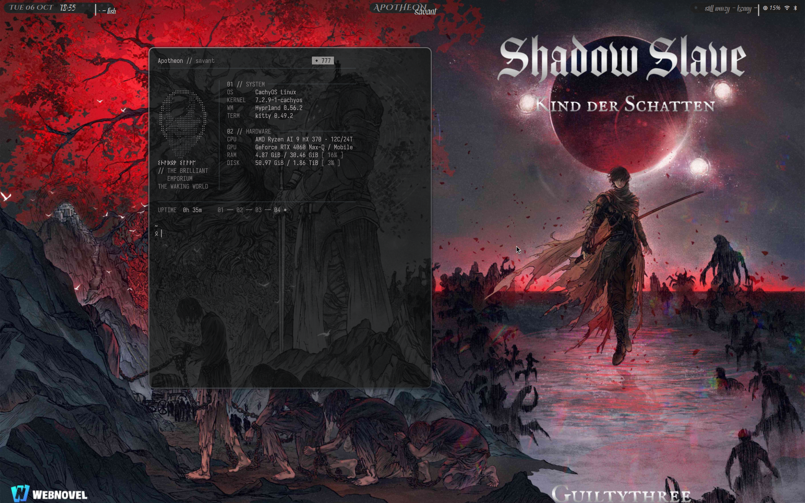
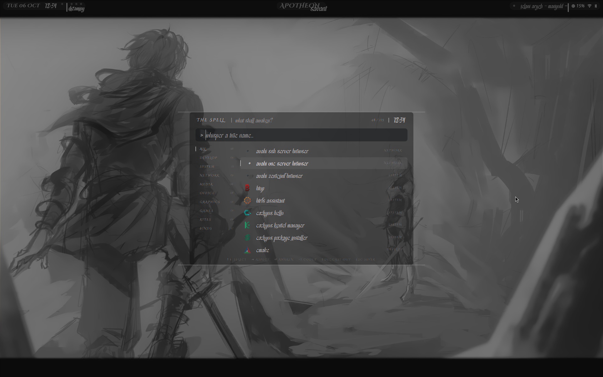

<div align="center">

# The Brilliant Emporium

*A Shadow Slave themed Hyprland + Quickshell rice.*







https://github.com/user-attachments/assets/03defd8a-263b-430f-9c54-7678054819ac


</div>

## Overview

Hyprlua config, with a complete Quickshell shell, and a login greeter, a GRUB theme and a Plymouth boot screen.
The palette is greys and (warm?) whites got sum runic bs instead of icons

| Part | What it does |
|---|---|
| **Bar** | Date, time and workspaces; host and user; now playing, memory, network, Bluetooth and notifications |
| **Launcher** | Apps, Hyprland keybinds and system rites in one search; a codex page per app (`Ctrl+I`); uninstall (`Shift+Delete`, twice) |
| **Control centre** | A rune sigil with four panels that decipher from runes: Wi-Fi and Bluetooth, audio and equaliser, media, notifications with DND and gamemode |
| **Clipboard** | `cliphist` history with image previews and search |
| **Notifications** | Toasts with hover-to-pause and a full history |
| **Power menu** | Suspend, log out, reboot and shut down, with press-twice confirmation |
| **Wallpaper picker** | A looping carousel; new wallpapers form out of scattering runes |
| **Greeter** | A greetd login screen whose rune rows decipher as you type |
| **Boot** | A GRUB theme and a Plymouth sigil |
| **Gamemode** | One key turns off the shell, animations, rounding, blur and glass, and brings them back |

Also themed: kitty, fish (starship), Zed, yazi, fastfetch, ncspot, Obsidian, Vesktop,
GTK and Qt.

## Requirements

- **Arch-based distro** (built on CachyOS)
- **Hyprland** with the **Lua** config (Hyprlang is not used)
- **Quickshell 0.3** or newer
- **hyprglass** plugin, for the glass effect (optional)

## Install

```sh
git clone https://github.com/iSavant/The-Brilliant-Emporium.git ~/The-Brilliant-Emporium
cd ~/The-Brilliant-Emporium
./install.sh
```

The installer installs packages, links every config into `~/.config` (backing up
anything it replaces), installs fonts, and asks before touching system files (greeter,
GRUB, Plymouth).

Options:

- `--no-packages` skips package installation
- `--no-system` skips the greeter, GRUB and Plymouth

### After installing

- **Monitors:** set yours in `~/.config/hypr/modules/monitors.lua`.
- **GPU:** set any GPU-specific environment variables in `~/.config/hypr/modules/env.lua`.
- **Highcrest font:** the accent font is personal-use only and can't be shared here.
  Download it yourself, name it `accent.ttf`, and put it in `private/` before running
  the installer. Without it, accent text falls back to another font.
- **GRUB background:** add your own `background.png` (2560x1600, or your screen size)
  to the GRUB theme folder.
- **Wallpapers:** put images in `~/Pictures/Wallpapers`.

## Keybinds

`SUPER` is the main modifier. The launcher (`SUPER+Space`) lists every bind; search
"bind" or a key to find one.

| Keys | Action |
|---|---|
| `SUPER+Return` | Terminal |
| `SUPER+Space` | Launcher |
| `SUPER+X` | Control centre |
| `SUPER+C` | Clipboard |
| `SUPER+W` | Wallpaper picker |
| `SUPER+Escape` | Power menu |
| `SUPER+G` | Gamemode |
| `SUPER+Q` | Close window |
| `SUPER+F` | Fullscreen |
| `SUPER+A` | Float |
| `SUPER+H J K L` | Focus left, down, up, right |
| `SUPER+SHIFT+H J K L` | Move window |
| `SUPER+CTRL+H J K L` | Resize window |
| `SUPER+1`–`0` | Workspace 1–10 |
| `SUPER+S` | Scratchpad |
| `SUPER+V` / `SUPER+SHIFT+V` | Screenshot screen / region |

## Credits

- **Inspiration:** [Tsugumori](https://github.com/Aleph1-9012) by Aleph1-9012
- **Theme:** *Shadow Slave* by Guiltythree
- **Fonts:** Cinzel Decorative by Natanael Gama, Noto Sans Runic by the Noto Project
  (both SIL Open Font License)
- **Built on:** [Hyprland](https://hyprland.org), [Quickshell](https://quickshell.org)

## Licence

The code is licensed under the GNU General Public License v3.0 (see `LICENSE`). Fonts keep their own licences (`OFL-*.txt`).
